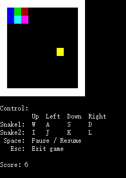
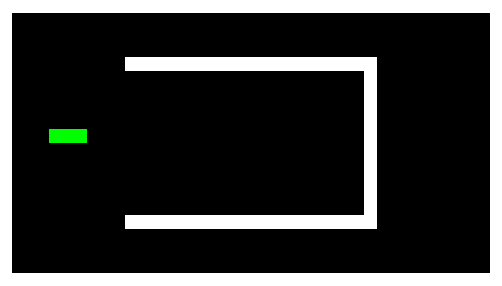
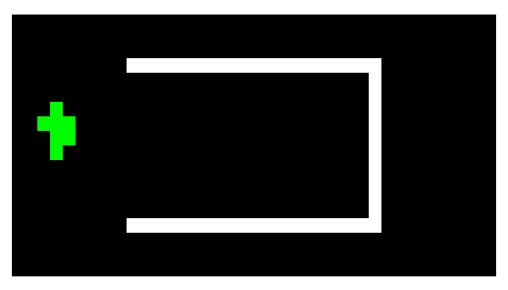

# Snake

A classic snake game in console(terminal) window. 

You can use this program to do:

1. Play classic snake game. (You can control two snakes at the same time!)
2. See how an intelligent computer snake eat the food. (Also, you can see two AI snake running at the same time!)
3. Run some test program for graph searching alogrithm such as BFS and DFS.
	
## Demos

AI:

1. Single snake(Windows)

   
   
2. Double snake(Ubuntu 14.04)

   
   
Algorithm test:

1. A* algorithm(Ubuntu 14.04)

   
   
2. BFS algorithm(Ubuntu 14.04)

   
   
## Compile and Run

Windows:

	Compile and run with Visual Studio or g++.
	
Linux:

```bash
$ cd src
$ make
$ make run
$ make clean
```
	
## Usage

```c++
int main() {
    auto game = GameCtrl::getInstance();

    // Set map's size. Default is 20*20
    // The minimum size is 4*4.
    game->setMapRow(20);
    game->setMapColumn(20);

    // Set FPS. Default is 60.0
    game->setFPS(59.0);

    // Set whether to make the snake automove. Default is true
    game->setAutoMoveSnake(true);

    // Set interval time(ms) for automove. Default is 200 ms.
    // If setAutoMoveSnake(false), this code is useless.
    game->setAutoMoveInterval(50);

    // Set whether to enable the second snake. Default is false
    game->setEnableSecondSnake(true);

    // Set whether to enable the snake AI. Default is false
    // If setAutoMoveSnake(false), this code is useless.
    game->setEnableAI(true);

    // Set whether to run the test program. Default is false
    game->setRunTest(false);

    // Set whether to write the map content to the file. Default is false
    // If set this attribute to true, the game map content will be written
    // to a file named "movements.txt" after each snake's movement.
    // PS: This is designed for debugging. Open this method may make the
    // snake move slower.
    game->setWriteToFile(false);

    return game->run();
}
```

## AI algorithm(Not the best)

```c++
void Snake::decideNextDirection() {
    if (isDead() || !map || !map->hasFood()) {
        return;
    }

    // Copy a temp snake with a temp map
    // Create two search path (food and tail)
    Snake tmpSnake(*this);
    shared_ptr<Map> tmpMap = std::make_shared<Map>(*map);
    tmpSnake.setMap(tmpMap);
    list<Direction> pathToFood, pathToTail;

    // Step1:
    // If a path to food is found, move the temp snake to eat the food and to 
    // check if there is path to the tail of the temp snake. If there is no path
    // to tail after eating the food, it means that this path is dangerous and
    // this path will not be chosen.
    // Notice that only if the length of the path to tail is more than
    // 1 can the snake move to its tail because that the length equals
    // 1 means that the head is adjacent to the tail, which will make 
    // the snake die after moving towards the tail.
    tmpSnake.findMinPathToFood(pathToFood);
    if (!pathToFood.empty()) {
        tmpSnake.move(pathToFood);
        if (tmpMap->isFilledWithBody()) {  // Check if the map is full
            this->setDirection(*(pathToFood.begin()));
            return;
        } else {
            tmpSnake.findMinPathToTail(pathToTail);
            if (pathToTail.size() > 1) {  // Check path to tail
                this->setDirection(*(pathToFood.begin()));
                return;
            }
        }
    }

    // Step2:
    // If no suitable path is found, make the snake move to its tail
    // along the longest way.
    this->findMaxPathToTail(pathToTail);
    if (pathToTail.size() > 1) {
        this->setDirection(*(pathToTail.begin()));
        return;
    }

    // Step3:
    // If no available path is found in step 1 and 2, then find a point
    // that is the farthest from the food.
    auto head = getHead();
    unsigned maxDist = 0;
    vector<Point> adjPoints(4, Point::INVALID);
    head.setAdjPoints(adjPoints);
    for (const auto &p : adjPoints) {
        if (!map->isUnsafe(p)) {
            unsigned d = Map::getManhattenDist(p, map->getFood());
            if (d > maxDist) {
                maxDist = d;
                direc = head.getDirectionTo(p);
            }
        }
    }
}
```

## Todos

1. Optimize longest path algorithm.
2. Optimize AI algorithm.
3. Use GUI library instead of console to run the program.
